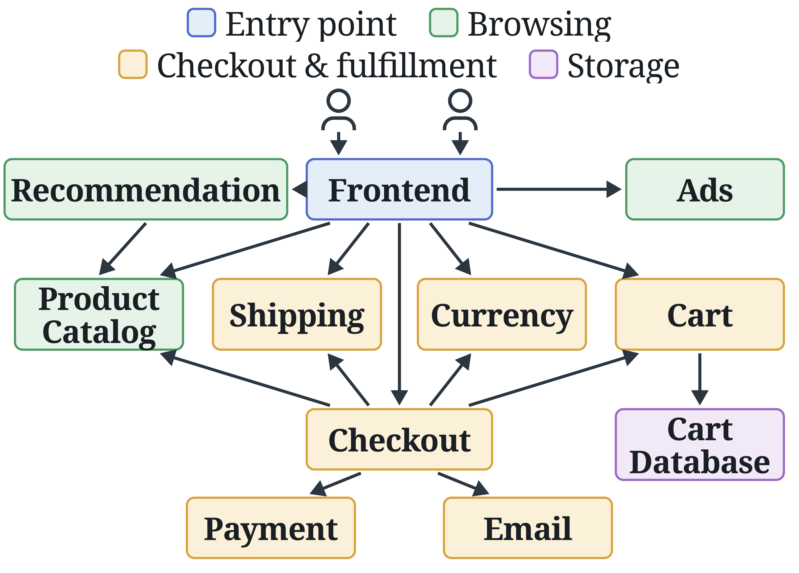
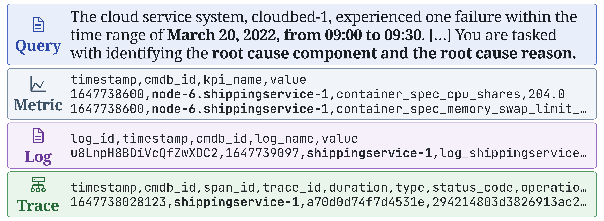

# Fig. 1: Inputs of microservice RCA in OpenRCA

(a) Call graph of Market (`fig_01a.pdf`) and (b) telemetry of `shippingservice-1` in Market during an incident (`fig_01b.pdf`).
Diagrams, included as the PDF files of the paper.

