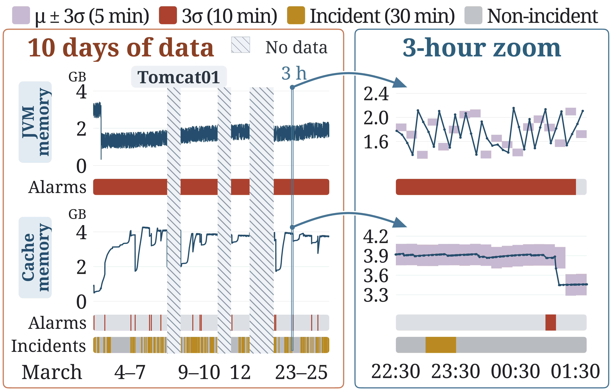

# Fig. 2: Signals exceeding tau in fault-free windows vs. only during failures (Section 3.1)

The existing data processing (z-score against the mean and standard deviation of the 5 minutes before the window, z >= 3) is applied to every
10-minute window of the ten recorded days of Bank for two metrics of Tomcat01, JVM memory and cache memory.

```bash
bash run.sh draw_normal_period.py      # tracks/fig_normal_period{,_10d,_zoom}.{pdf,png} and the window counts
```

The script prints the counts that Section 3.1 reports: JVM memory exceeds tau in 850 of the 881 fault-free windows (97 %), and cache memory
exceeds it in 17 windows, 13 of them inside incident windows. `fig_02.pdf` is the figure of the paper, composed from these tracks.

Inputs (`data/`): the two series (`metric_pair_series.json`, `metric_pair_bins.json`), the incident windows (`incident_windows.json`) and the
per-window bands of the rule (`band_tables.json`). `prep_bands.py` computed `band_tables.json` from the raw OpenRCA Bank telemetry
(`$RCA_DATASETS/OpenRCA/Bank/telemetry/`); `run.sh` runs a script in `work/` with the data files beside it.


