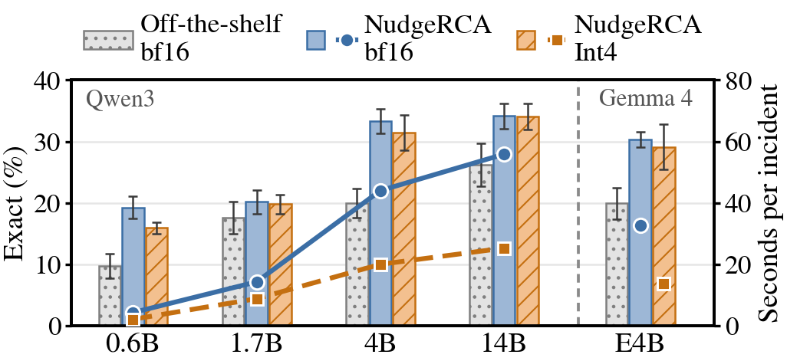

# Fig. 7: Exact and latency of NudgeRCA by model and model size

`fig_07.py` draws `fig_07.pdf` from:

- `data/data_model_size.json`: Exact (avg@8) per Qwen3 size and dataset for the off-the-shelf model on the EOB input (`base`), NudgeRCA in
  bf16 (`ours`) and NudgeRCA in GPTQ W4A16 (`-Int4`); the figure averages Telecom, Bank and Market.
- `data/data_gemma_e4b.json`: the same three conditions for Gemma 4 E4B (`Gemma4-E4B|…|base`, `Gemma4-E4B|…|ours`, `Gemma4-E4B-Int4|…|ours`).
- `data/latency/`: seconds per incident on one NVIDIA L40S (one response, incidents sent one at a time, model loading excluded, the first
  ten evaluation incidents of each dataset). `l40s/` holds the probes (`<Size>_<trained|trained-int4>_<ds>.json` for Qwen3,
  `Gemma4-E4B_<trained|trained-int4>_<ds>.json` for Gemma 4 E4B); `code/collect_latency.py` writes `summary_l40s.json` from the Qwen3 probes,
  and `gemma_l40s.json` summarizes the Gemma 4 E4B probes.

Error bars: every run generates eight responses per incident, and response k of every incident is taken as the k-th repetition of the run.
`code/collect_error_bars.py` scores each repetition, averages Exact over Telecom, Bank and Market, and writes the standard deviation over the
eight repetitions to `data/exact_sd.json`; it also checks that the mean of the repetitions equals the plotted value. The responses are under
`data/qwen3-<size>/outputs/<base|ours>/`, `data/int4/outputs/qwen3-<size>/` and `data/gemma4-e4b/outputs/<base|ours|int4>/` (Qwen3-4B
off-the-shelf and bf16 NudgeRCA: `nudgerca/inference/outputs/`). Gemma 4 closes its reasoning with `<channel|>`, so its answer is read after
that token.

`code/` holds the scripts that merge an adapter in float32, quantize it with GPTQ (W4A16, group size 128, calibration on the 198 training-pool
prompts) and probe the latency: `run_int4.sh` for the Qwen3 sizes and `run_int4_gemma4.sh` for Gemma 4 E4B. Gemma 4 differs in two respects:
its calibration runs through the whole model (the last 18 layers reuse the KV states of an earlier layer, so layer-by-layer calibration fails),
and every linear layer of its language model is quantized (`quantize_gptq_gemma4.py`); `family.py` builds the Gemma 4 prompt and sampling
settings used by the probe.

